# Pasos para la integración de WhatsApp API

En este artículo te enseñaremos a como realizar la implementación del WhatsApp API con nuestra plataforma de mensajería de [Chat Búho](https://buho.la/chat).

:::info MIRA:

Mira nuestro video de la implementación con **[WhatsApp API](https://buho.la/ayuda/productos/chat-buho/whatsapp-api-y-facebook/video-de-integracion-con-whatsapp-api).**

:::

Sigue los pasos a continuación para poder realizarlo:

 ## 1. Ingresar a Facebook

Para realizar este primer paso, debe tener una cuenta de **Fanpage** (Página en FB) y tener su cuenta comercial en el **Administrador comercial**, para ello debes ingresar a tu cuenta personal de Facebook y ubicarse en la sección de **Inicio** o el botón que tiene el ícono de Hogar. 🏠 

Luego deberás ubicarte en la sección lateral izquierda y seleccionar la opción de **Administrador Comercial**.

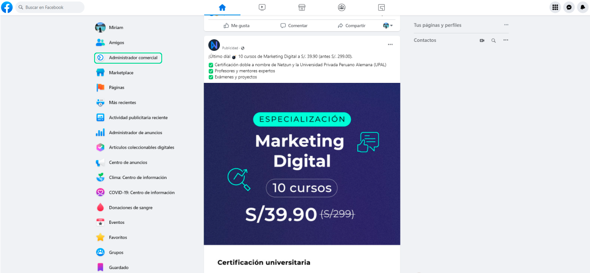

Posteriormente visualizarás todas las **herramientas** administrativas de tu fanpage.

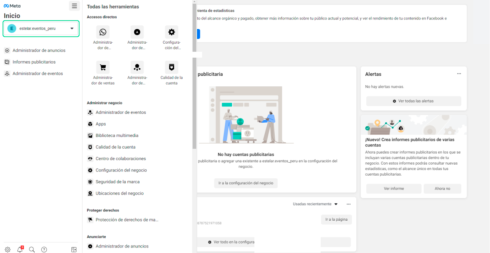

:::Info RECUERDA:

Es importante seleccionar la cuenta del administrador comercial que esté relacionada a la fanpage, en el menú desplegable.

:::

## 2. Ingresar a Facebook Developers

Por consiguiente deberás ingresar a este link **https://developers.facebook.com/?locale=es_ES** , en esta área se crearán los accesos para la implementación del WhatsApp API con la plataforma de Chat Búho.

Visualizarás la página de Facebook Developers y se ingresará a **My Apps**, en caso de **no tener una cuenta creada**, en la misma ubicación aparecerá un botón de **Iniciar, Empezar o GeT Started**, que se deberá seleccionar para crear la cuenta de facebook developers.

Regístrese con su cuenta de Facebook relacionada a su **Página de Facebook.**

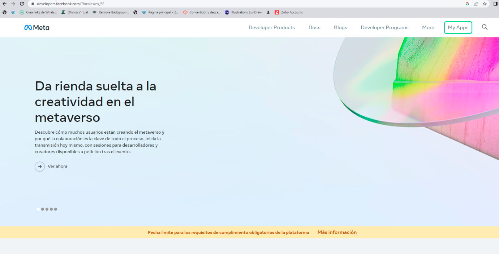

## 3. Creación de App
Luego de ingresar a **My Apps**, encontrarás la ventana de **creación de Apps** y se deberá seleccionar el botón **Crear App**.

Selecciona el tipo de app **Negocios** y selecciona el botón **Siguiente.**

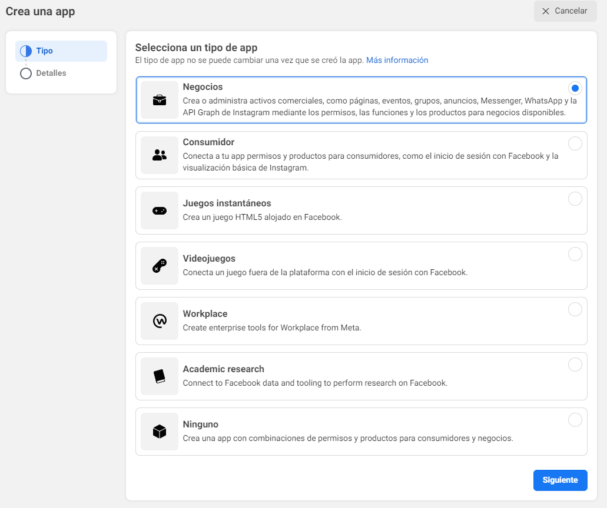

Luego visualizarás los siguientes campos a llenar:

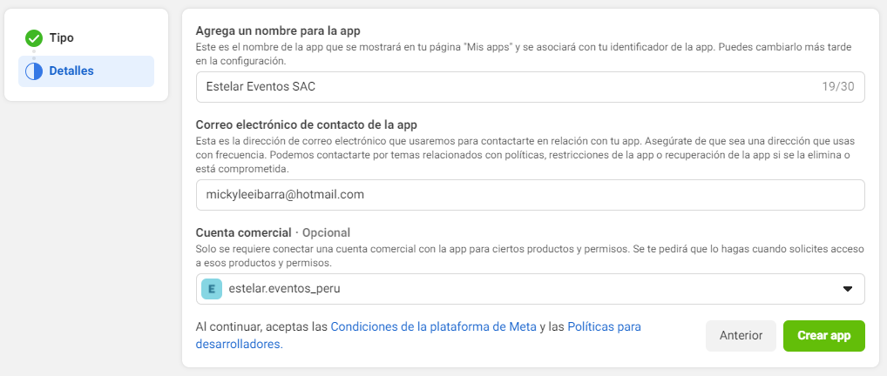

* **Nombre para la App:** Este es el nombre de la app que se mostrará en tu página **"Mis apps"** y se asociará con tu identificador de la app. 
* **Correo electrónico de contacto de la app:** Esta es la dirección de correo electrónico que usaremos para contactarte en relación con tu app. Asegúrate de que sea una dirección que usas con frecuencia. Podemos contactarte por temas relacionados con políticas, restricciones de la app o recuperación de la app si se la elimina o está comprometida.
* **Cuenta comercial:** Deberá colocar la cuenta comercial relacionada a su Fanpage.
Después selecciona el botón **Crear App**, probablemente nos pida ingresar la contraseña de la cuenta para confirmar la acción.

## 4.  Agrega productos a tu App
A continuación se agregará el producto de **WhatsApp** para proceder con la integración.

Selecciona el botón **Configurar** y aparecerá en la sección lateral izquierda, el módulo de **WhatsApp** y sub-opciones. Deberás ingresar a **primeros pasos**.

## 5.  Agrega número de la integración
En esta sección deberás ingresar el número a integrar con WhatsApp API, luego seleccionar el botón **Agregar número de teléfono.**

:::info RECUERDA:
El número de la integración no debe contar con cuenta asociada de WhatsApp Messenger o Business y tampoco la app instalada, debido a que es un requisito importante que solicita Facebook. Te invitamos a leer nuestro artículo **[Migración WhatsApp Business al WhatsApp Api : Preguntas Frecuentes](/docs/whatsapp-api-facebook/Migracion-WhatsApp-Business-al-WhatsApp-Api-Preguntas-Frecuentes.md)**
:::

Luego aparecerá el formulario de creación de perfil de **WhatsApp Bussiness.**

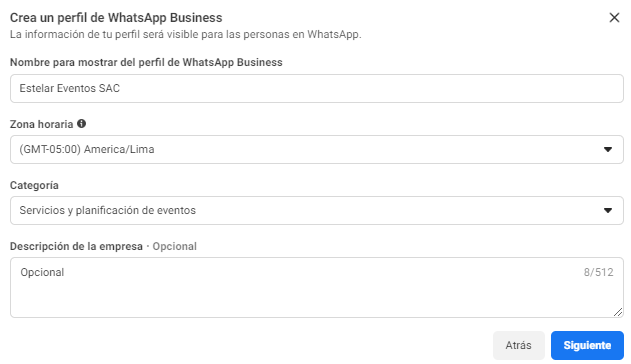

Se procederá a llenar los siguientes campos:

* **Nombre de Perfil:** Nombre comercial de la empresa.
* **Zona horaria:** Colocar América/Lima o la zona de la ubicación actual.
* **Categoría:** Categoría del negocio.
* **Descripción de la empresa:** Es opcional.
  
Después selecciona el botón **Siguiente** y agregaremos en el campo número de teléfono el prefijo **PE +51**  más el número de la integración, Ejemplo: **PE+51 xxx xxx xxx** , luego elige como verificar el número (Mensaje de texto o Llamada telefónica) y selecciona el botón **Siguiente.**

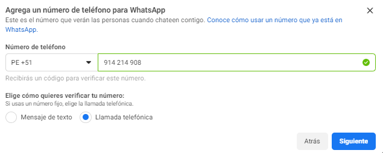

Luego revisa el mensaje que llego a tu celular e ingresa **el código de verificación**, selecciona el botón **Siguiente** y se habrá agregado el número de WhatsApp.

## 6.  Selecciona el número de la integración
Primero deberás **seleccionar el número** que se agregó para la integración. 

Posteriormente es importante conocer estos 2 tipos de identificadores:

* **Identificador de número de teléfono o ID de número de teléfono:** 100251529610633
* **Identificador de la cuenta de WhatsApp Business o ID de cuenta de negocio:** 107059678917748

:::danger IMPORTANTE:
Estos datos del número de whatsapp están dentro del **cuadro verde**, cada número cuentan con identificadores diferentes, asimismo se usarán para la **sección nro 8 de la implementación en plataforma de ChatBúho**.

:::

## 7.  Creación del Token permanente o Clave API
Posteriormente, esta sección se creará la **Clave API permanente**, que servirá para conectar el numero de WhatsApp API con nuestra Plataforma **[Chat Búho](https://buho.la/chat)**. La clave API la usaremos en la sección **nro 8 de la implementación en plataforma de ChatBúho**.

Para ello debemos dirigirnos a mis Apps que está en la barra superior de la página.

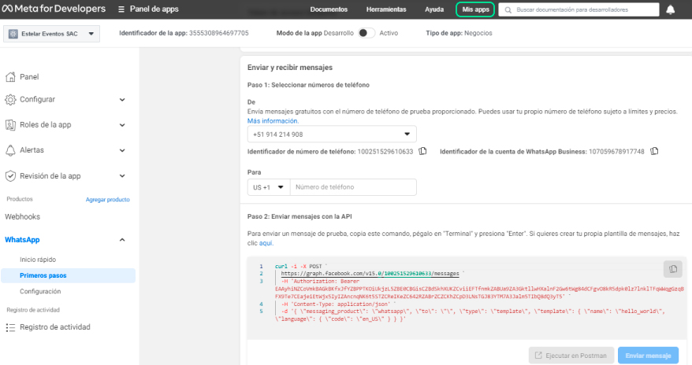

Y seleccionar el nombre del negocio en texto azul.

Después nos dirigirá a **configuración del negocio**, nos ubicamos en **Usuarios de la cuenta** y debemos de agregar al usuario del sistema.

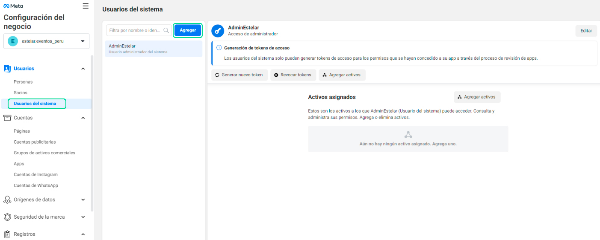

Agrega los siguientes datos **Nombre del usuario** y el rol como **administrador**, luego selecciona **Crear usuario del sistema.**

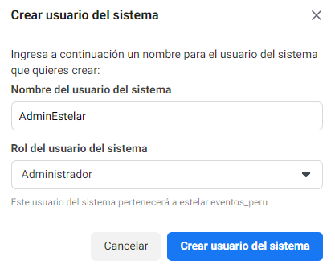

Después selecciona el botón **Agregar activos**

Aparecerá la siguiente ventana, selecciona **Apps**, **nombre** y luego **administrar App**, finalmente **Guardar Cambios**.

Posteriormente podremos visualizar la app agregada.

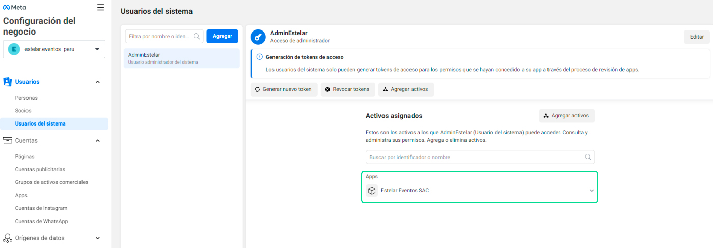

Y seleccionamos el botón **Generar nuevo token**

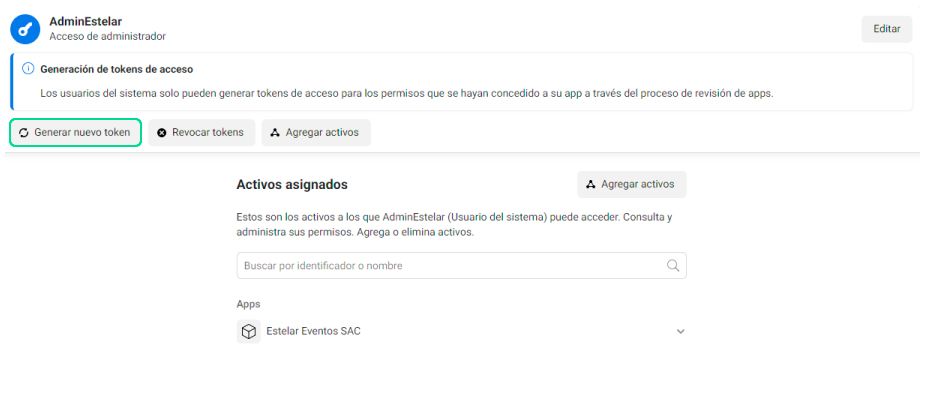

Aparecerá una ventana donde se deberá seleccionar la App creada previamente.

Además se deberá de seleccionar los siguientes permisos:

* **whatsapp_business_messaging**
* **whatsapp_business_management**

Después se procederá a seleccionar le botón de **Generar token.**

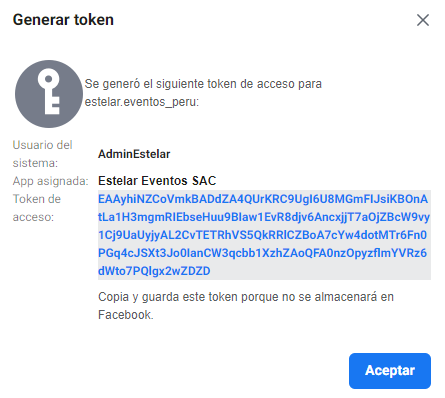

:::info IMPORTANTE:
El token permanente deberás **guardarlo** en tus archivos, porque se usará para la integración final.

:::

## 8.  Implementación en plataforma de Chat Buho
Ingresa a la plataforma **https://chat.buho.la/** e introduzca el usuario y contraseña.

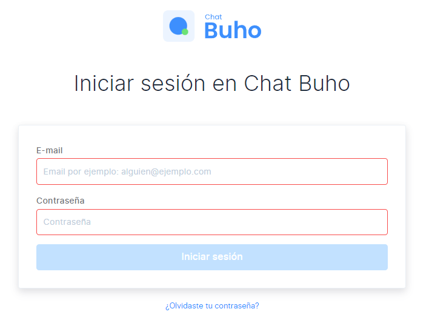

Luego ingresa al módulo de **Ajustes ⚙️ > Entradas > Añadir bandeja de entrada.**

Por consiguiente deberás elegir un canal , en este caso deberás seleccionar **WhatsApp.**

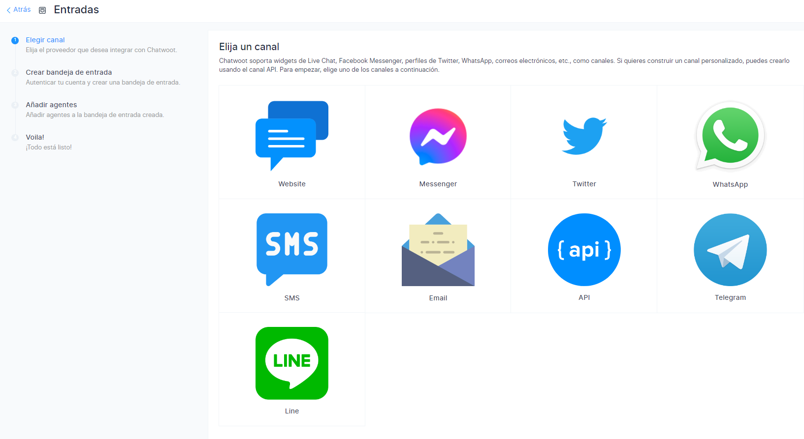

Luego deberás crear la bandeja de entrada y llenar los siguientes datos:

* **Proveedor de API:** Seleccionar Nube de WhatsApp.
* **Nombre de la bandeja de Entrada:** Nombre identificador, por ejemplo: WhatsApp Ventas.
* **Número de teléfono:** Seleccionar número de teléfono a integrar.
* **ID de número de teléfono o Identificador de número de teléfono:** Leer la sección **nro 06**, selecciona el número de la integración. 
* **ID de cuenta de negocio o Identificador de la cuenta de WhatsApp Business:**  Leer la sección **nro 06**, selecciona el número de la integración.
* **Clave de API:** Leer la sección **nro 7**, creación de token permanente.

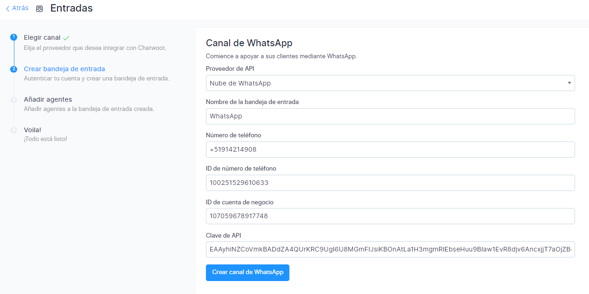

Después debes seleccionar el botón **Crear canal de WhatsApp** y agregar a los agentes de su equipo que contestarán los chats.

Despues de **[añadir a los agentes](/docs/configuracion-inicial/Anadir-agentes.md)** aparecerán los datos del Webhook, recuerda copiarlos y guardarlos.

## 9.  Configuración Webhook
Posteriormente deberás dirigirte a tu cuenta de Facebook developers y escoger la opción del texto azul **Configurar Webhooks.**

Te redirigirá a la configuración del webhook, primero deberás seleccionar el botón **Editar.**

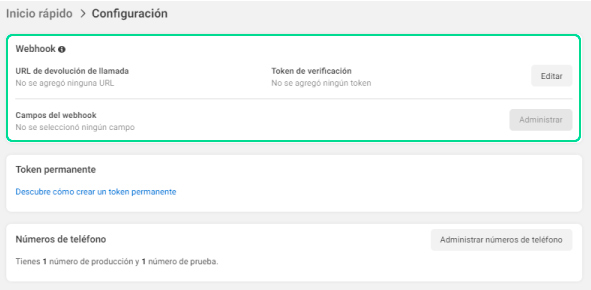

Asimismo agregar la **URL** y **el token de verificación.**

Después seleccionar el botón **verificar y guardar.**

Finalmente, selecciona el botón de **Administrar.**

Y deberás suscribirte a **messages**, para recibir los mensaje de WhatsApp.

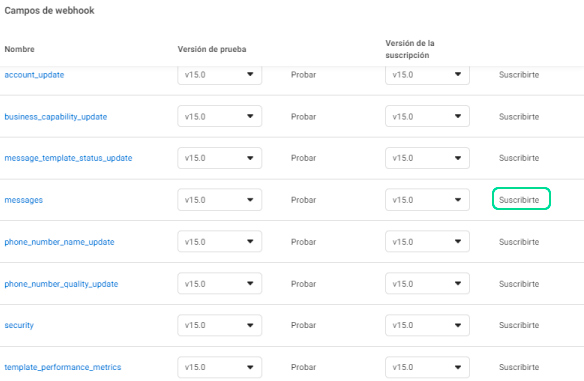

## 10.  Cambiar modo de la App
Luego de realizar todos los pasos, deberás continuar con este último e importante paso, cambiar modo de la app **"de desarrollo a activo"**

Para ello debes de seleccionar el botón de **modo de la app.**

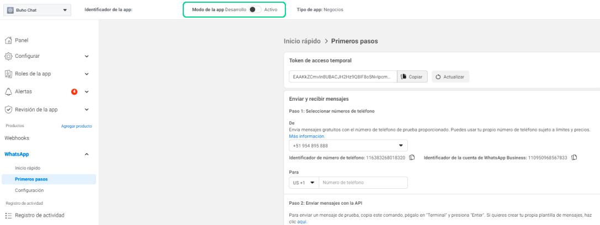

Luego selecciona el texto en azul, **configuración básica.**

Luego selecciona el texto en azul, configuración básica.

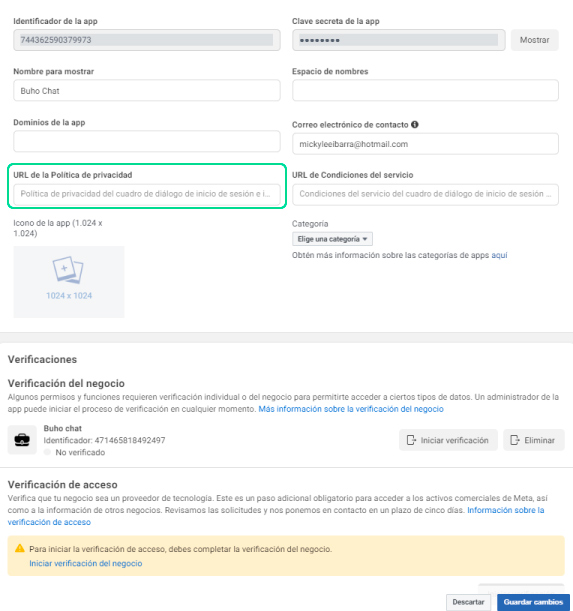

Mira nuestro video de la **[implementación con WhatsApp API](/docs/whatsapp-api-facebook/Video-de-%20integraci%C3%B3n-con-WhatsApp-API.md).**

:::info RECUERDA:

Después de estos pasos, puede hacer pruebas de conversaciones en la plataforma de **[Chat Búho](https://buho.la/chat).**
Asimismo deberás crear las plantillas de mensajes para iniciar una conversación pasadas las 24 horas, para saber cómo realizarlo, **[mira este artículo](/docs/configuracion-inicial/Plantillas-de-mensajes.md).**
:::
